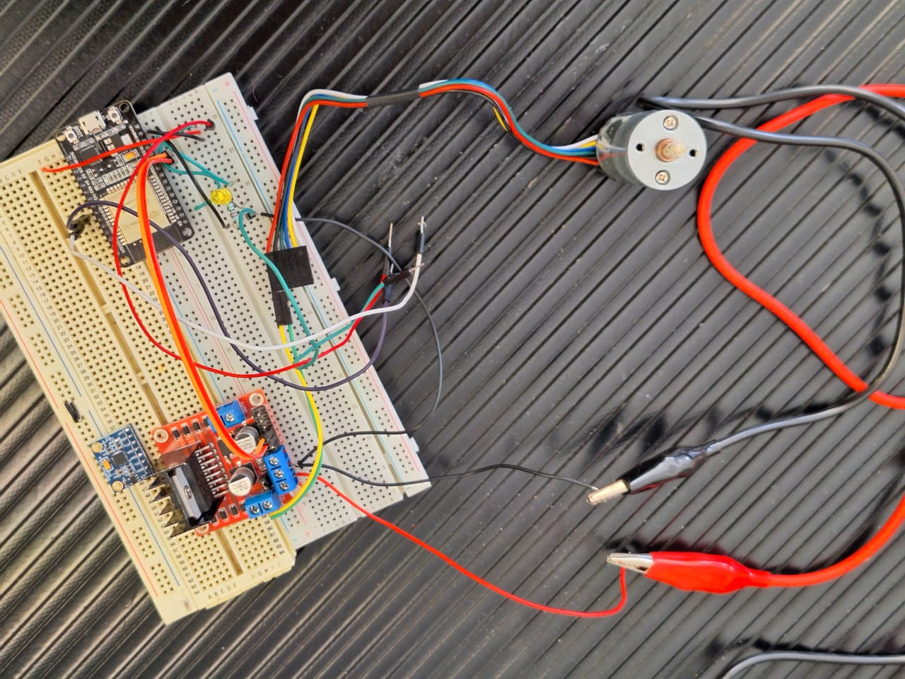
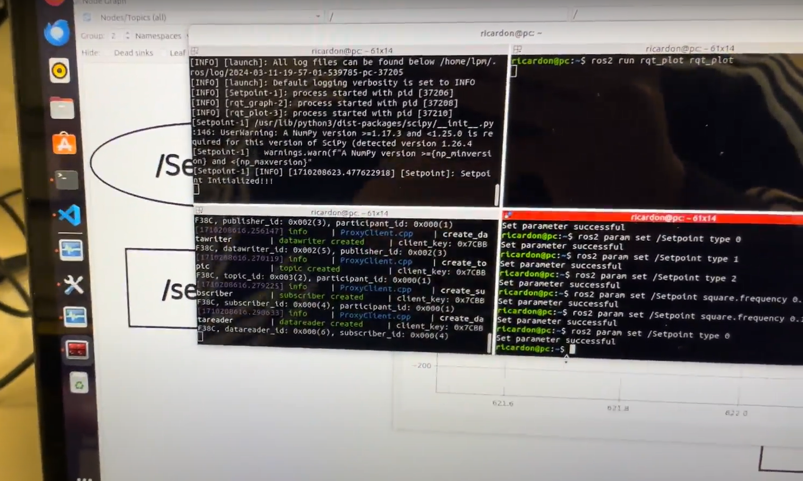
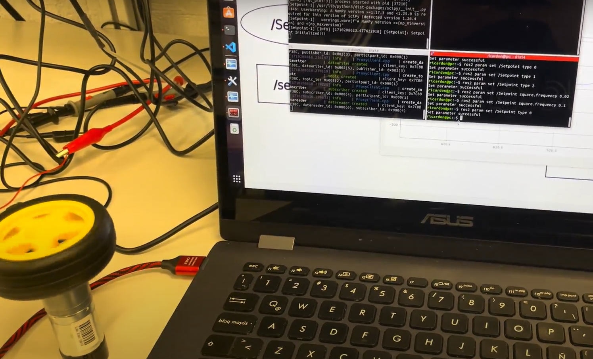
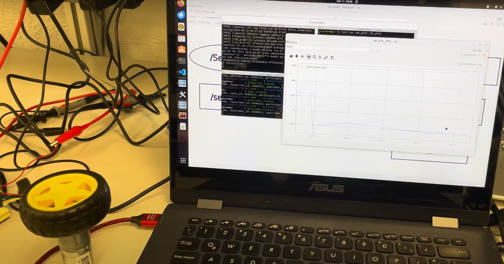
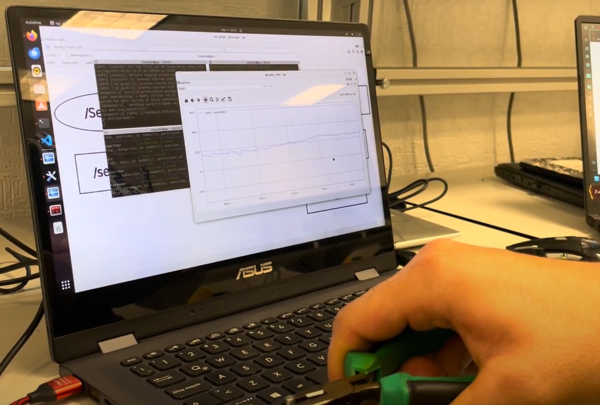

# TE3001B_Robotics_Foundation_2024
  
Team Dynamic Orchestrators
  - Fernando Josué Matute A00833375
  - Ricardo Navarro Gómez A01708825
  - Sergio Macias Corona A01352038

## **Introduction**
Working with our partner Manchester Robotics, we create a system that controls the speed of a 6V DC Motor using ROS II and the amplementation of a PID controller. Manchester helped us going through the basics of ROS II and other relevant topics such as MicroRos. We worked hardly five weeks on this project learning the basics of ROS II, working on the design of our controller and working with our ESP32 and DC Motor.

## **Solution**
A PID controller implemented on our ESP32, which receives signals from ROS II to adjust the control of speed of our DC Motor, working with its max speed, implementing diferent input functions to modify the pwm signal given to the motor.

## **Software used**
  - ROS II
  

  
   
  ROS II Documentation:
   
  Humble Distribution: https://docs.ros.org/en/humble/Installation/Ubuntu-Install-Debians.html
  

  
  - Ubuntu 22.04
  

  
   
  Jammy Jellyfish Distribution:
   
  https://releases.ubuntu.com/jammy/
  

  
  
## **Hardware**
- ESP32
  

  
   
  Setting up your ESP32:
   
  https://randomnerdtutorials.com/installing-the-esp32-board-in-arduino-ide-windows-instructions/
  

  
- Debbuging:
  

  Failed to connect to ESP32: Timed out waiting for packet header:
   
  https://randomnerdtutorials.com/?s=+Timed+out+waiting+for+packet+header
  

## **Implementation**
  - Circuit
  

  
   
  - Launch node
   
  
   
  - System working
   
  
   
  - System Working Signal
   
  
   
  - PWM Up
   
  
  

